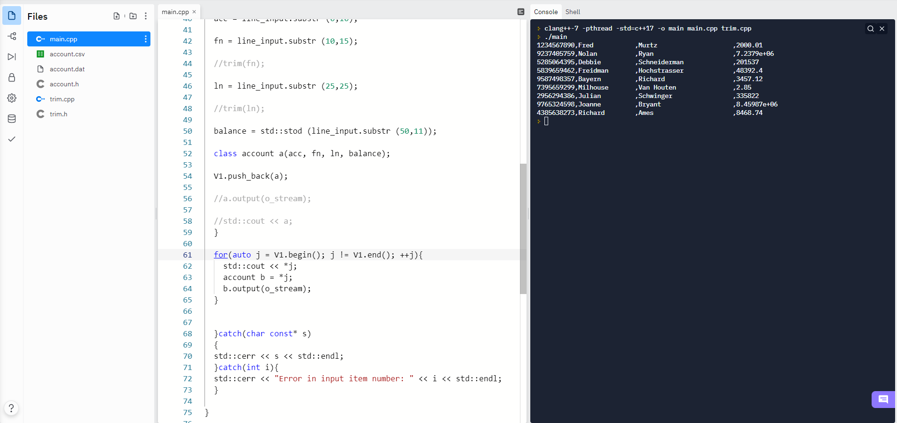

# Cpp-6-Input-Account-Information

## Gets account data from an input file, and stores them in a Vector

#### Abstract
This program reads account information in from the file **account.csv**. It creates *account* objects from each line input from the file. These account objects are then stored in an *account* Vector. This vector is then printed to the console, and to the file **account.dat**. The *ostream* operator is overloaded for the *account* object to make printing to the screen, and to files easier.

#### Account object
```
class account{
  private:
  std::string account_code;
  std::string first_name;
  std::string last_name;
  double balance;
```

#### Description
The *main* function is enclosed in a try-catch block to create controlled error checking. The program starts by opening the input stream from **account.csv**, and the output stream to **account.dat**. The variables are declared which will be used to construct each *account* object, and the *account* vector is declared. A while loop is entered that will read each line of input for each loop. As each line of input is read from **account.csv** each comma separated value is read into a different variable, and those variables are fed into a constructor to construct an *account* object. Each account object is then pushed to the vector. This process repeats until the end of file is reached. One the loop is exited, each *account* in the vector is printed to the console, and to the **account.dat** file. 

#### Screenshot of the program running
